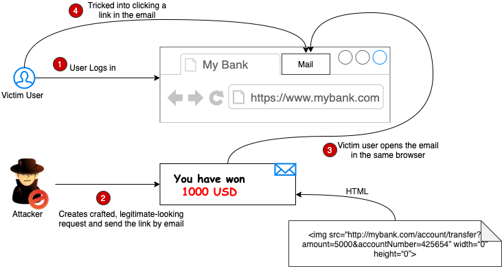

# CSRF

https://owasp.org/www-community/attacks/csrf

https://reflectoring.io/complete-guide-to-csrf/

https://tibetsandfox.tistory.com/11

<br>



<br>

CSRF(Cross-Site Request Forgery)는 공격자가  사용자 권한을 이용하여 사용자가 현재 접속되어 있는 특정 웹 사이트에서 원치 않은 기능을 실행하게 하는 것이다. 
2008년에 발생한 옥션의 개인정보 유출사건에서도 관리자 계정을 탈취하는데 이 방법이 사용되었다. 공격의 난이도가 높지 않아 널리 사용되는 방법 중 하나다.

img 태그도 GET 메소드를 사용해서 보내는 것이기 때문에 img를 이용할 수도 있다.

CSRF의 공격이 수행되기 위해서는 몇가지의 조건이 필요하다.
1. 사용자가 공격자가 만든 피싱사이트에 접속할 것
2. 사용자가 위조 요청 보낼 사이트에 로그인 되어 있을 것

<br>

## 공격구문
접속 시 로그아웃 시키기

```bash

```

## 대응방안
1. CAPCHA 사용, 이미지를 보여주고 그 이미지 해당하는 숫자, 문자 등을 고르는 것
2. Referrer 검증법, 요청이 들어올 때 requset의 header에 담겨있는 referrer 값을 확인하여 같은 도메인에서 보낸 요청인지 검증하여 차단하는 방법
   
   하지만 동일 사이트 내에서 XSS 취약점이 발견된다면 이를 통하여 CSRF 공격을 실행할 수 있다
3. CSRF Token 사용, 사용자 세션에 임의의 값을 저장하여 모든 요청마다 그 값을 포함하여 전송한다. 그리고 요청이 들어올 때마다 백엔드에서 세션에 저장된 값과 요청으로 전송되는 값이 일치하는지 검증하는 방법


<br><br>

---
XSS 공격과 헷갈리는 경우가 있는데 CSRF는 특정 행동을 수행키는 것이고 XSS는 자바스크립트를 실행 시키는 것이다.