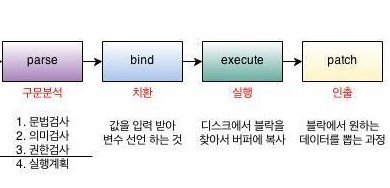

# SQL Injection
https://blog.naver.com/skinfosec2000/220482240245
<br>
https://ssunws.tistory.com/44
<br>
https://pentestmonkey.net/category/cheat-sheet/sql-injection - cheat sheet
<br><br>
SQL Injection 이란 악의적인 사용자가 보안상의 취약점을 이용하여, 임의의 SQL 문을 주입하고 실행되게 하여 데이터베이스가 비정상적인 동작을 하도록 조작하는 행위이다.
<br>

### -- 2021 OWASP TOP 10 --
A03: Injection (인젝션)
SQL, NoSQL, OS 명령, ORM(Object Relational Mapping), LDAP, EL(Expression Language) 또는 OGNL(Object Graph Navigation Library) 인젝션 취약점은 신뢰할 수 없는 데이터가 명령어나 쿼리문의 일부분으로써, 인터프리터로 보내질 때 취약점이 발생합니다. 
<br>

## 공격구문
```
'
' or 1=1 --
' or 1=0 --
' and db_name() > 1 --
```

<br>

## 대응방안
### # 매개변수 바인딩 & 저장프로시저 & prepared statement
<br>


<br><br>

prepared statement를 사용하는 경우엔는 효율을 높이기 위해 <strong>parse</strong> 과정을 최초 1번만 수행하고 이후에는 생략할 수 있다. <strong>parse</strong> 과정을 모두 거친 후에 생성된 결과는 메모리 어딘가에 저장 해두고 필요할 때마다 사용한다. 반복적으로 트리를 사용하기 위해서 자주 변경되는 부분을 변수로 선언해 두고 매번 다른 값을 바인딩하여 사용한다.
<br><br>
바인딩 데이터는 문법 처리과정에서 미리 선 수행되고 SQL 문법이 아닌 내부의 인터프리터나 컴파일 언어로 처리하기 때문에 문법적인 의미를 가질 수 없다. 따라서 바인딩 변수에 SQL공격를 할지라도 공격은 실패한다.
<br><br>
### # 화이트리스트
화이티리스트란 '안전'이 증명된 것만을 허용하는 것으로 '악의성'이 입증된 것을 차단하는 블랙리스트 보안과 상반되는 보안 방식 이다. 화이트리스트, 블랙리스트라는 용어 대신 'positive'와 'nagㄴative' 보안 방법으로 불려지기도 한다.
<br><br>

### # 입력 값 필터링
<br>

### # 최소한의 권한 사용
<br>

### # 오류 메시지 출력 제한