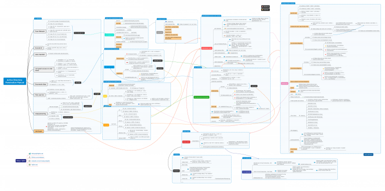

# Active Directory Penetration Mind Map - CheatSheet
https://tajdini.net/blog/penetration/active-directory-penetration-mind-map/

https://www.youtube.com/user/ngnicky1209

# AD(Active Directory)란? 사용자가 마이크로소프트 IT 환경에서 업무를 수행하는 데 도움을 주는 데이터베이스이자 서비스 집합이다.
  
MS Windows 사용자들을 서로 그룹으로 단위로 제어하기 위한 목적으로 AD를 사용한다.
  
MS에서 AD 환경은 매우 중요하다.
  
관리자 도메인 정보가 탈취가 되었으면 연결되어 있는 모든 PC 정보들도 탈취 가능성 존재한다.
  
외부 시스템 탈취부터 내부 시스템 해킹까지의 과정을 인프라를 직접 구축해서 실습해보면 큰 도움 된다. 추후 할 예정이다.

 
<h1>no credentials</h1>
<h2>Scan Network</h2>
<ul> 
nmap -sP -p <'ip'> # ping scan

nmap -PN -sV --top-ports 50 --open <'ip'> #
quick scan
nmap -PN --script smb-vuln* -p139,445 <'ip'> #
search smb vuln
</ul>

# port scan 같은 경우에는 nmap이 주로 사용된다.

 
<h2>List guest access on smb
share</h2>
<ul>
enum4linux -a -u "" -p "" <'dc-ip'> &&
enum4linux -a -u "guest" -p "" <'dc-ip'>

smbmap -u "" -p "" -P 445 -H <'dc-ip'> &&
smbmap -u "guest" -p "" -P 445 -H <'dc-ip'>

smbclient -U '%' -L //<'dc-ip'> && smbclient -U '
guest%' -L //<'dc-ip'>

cme smb <'ip'> -u '' -p '' # enumerate null
session
</ul>

# 만약 smb 관련된 포트가 열려있다면 enum4linux, smbmap 도구들을 이용해 계정정보 획득 가능

 
<h2>Find user list</h2>
<ul>
enum4linux -U <'dc-ip'> | grep 'user:'

crackmapexec smb <'ip'> -u <'user'> -p '<
password>' --users
</ul>

# brute force 공격, OSINT 검색을 통해 노출되어 있는 정보 확인 가능
