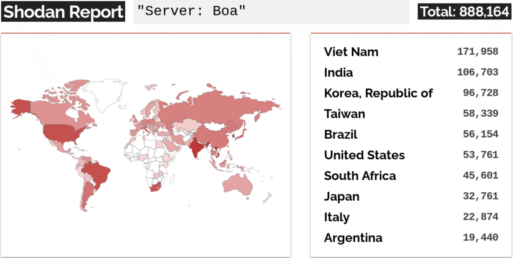

# 오래된 웹서버 BOA 취약점을 이용한 해킹

https://www.youtube.com/user/ngnicky1209

https://www.bleepingcomputer.com/news/security/hackers-breach-energy-orgs-via-bugs-in-discontinued-web-server/

https://www.criminalip.io/asset/search?query=Boa%2F0.94.14rc21

https://www.exploit-db.com/exploits/42290

Boa는 2005년부터 단종 된 임베디드 애플리케이션에 적합한 오픈 소스 소형 웹 서버 입다.

---

Microsoft는 2005년 이후 중단된 소프트웨어 솔루션인 **BOA** 의 웹 취약한 구성 요소를 악용했다고 밝혔다. 이 소프트웨어 솔루션은 현재까지 많은 IoT 장치에서 사용되고 있다.

Microsoft에 따르면 인터넷에 노출된 100만개 이상의 Boa 서비스가 감지 되었다고 밝혔다.

이러한 취약점을 이용한 공격 중 하나로 HIVE 랜섬웨어는 인도 최대 통합 전력 회산의 Tata Power를 해킹하였다.

이 공격은 2022년에 일어난 하나의 공격일뿐 가장 최근에는 10월에도 공격이 있었다고 밝혔다.

 

OSINT - Criminal IP 에서도 많은 수가 검색이 되는 것을 볼 수 있다.

 

exploit db에서 취약점 내용도 확인 할 수 있다.

 

취약한 오래된 버전은 최신으로 업데이트 하기를 권장한다.
할수 없다면 다른 최신 버전의 소프트웨어로 바꾸길 권장한다.